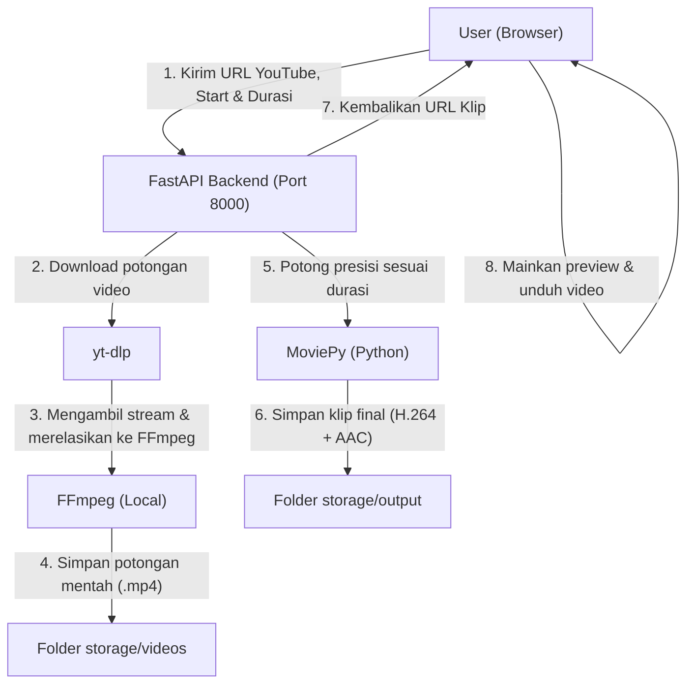

# Panduan & Penjelasan Lengkap: Auto Clip 🎬

**Auto Clip** adalah aplikasi web lokal yang berfungsi untuk mengunduh bagian tertentu dari video YouTube dan menyimpannya sebagai file video MP4 berdurasi singkat secara instan. Proyek ini dibuat dengan arsitektur modern yang memisahkan **Frontend (Next.js)** dan **Backend (FastAPI)**.

---

## 🗺️ Arsitektur Aplikasi

Aplikasi ini berjalan sepenuhnya secara lokal di komputer Anda menggunakan alur kerja berikut:



---

## 📂 Struktur File dan Folder

Berikut adalah penjelasan fungsi setiap file penting dalam proyek ini:

*   **`frontend/`** (Next.js + Tailwind CSS)
    *   [page.tsx](file:///c:/Users/FACHRY/Documents/project%20sekolah/clip/frontend/app/page.tsx): Halaman utama aplikasi (UI). Mengatur formulir input, animasi loading, pemutar video preview, dan proses unduhan file video secara aman dari browser.
    *   [globals.css](file:///c:/Users/FACHRY/Documents/project%20sekolah/clip/frontend/app/globals.css): Pengaturan tema visual (UI styling), efek glassmorphism, background radial glowing orb, dan animasi shimmer loading.
*   **`backend/`** (FastAPI + Python)
    *   [main.py](file:///c:/Users/FACHRY/Documents/project%20sekolah/clip/backend/main.py): Entrypoint API server. Menyediakan rute `/generate-clip`, mengatur kebijakan CORS agar bisa diakses oleh Next.js, serta menyajikan klip video hasil ekstraksi sebagai file statis.
    *   [downloader.py](file:///c:/Users/FACHRY/Documents/project%20sekolah/clip/backend/downloader.py): Modul pembungkus *yt-dlp* yang berfungsi mengunduh video. Dilengkapi fitur pencarian otomatis file eksekusi `ffmpeg.exe` pada sistem Windows.
    *   [clipper.py](file:///c:/Users/FACHRY/Documents/project%20sekolah/clip/backend/clipper.py): Modul pembungkus *MoviePy* yang memotong video dengan presisi dan menyimpannya menggunakan codec video `H.264` dan audio `AAC` agar kompatibel diputar di browser web mana pun.
    *   [requirements.txt](file:///c:/Users/FACHRY/Documents/project%20sekolah/clip/backend/requirements.txt): Daftar pustaka Python yang wajib diinstal di dalam virtual environment.

---

## 🛠️ Penjelasan Detail Cara Kerja Kode

### 1. Backend: Mengunduh Video Secara Pintar (`downloader.py`)
Mengunduh video YouTube berdurasi panjang sangat memakan kuota dan waktu. Proyek ini menggunakan parameter `--download-sections` dari **yt-dlp** agar hanya mengunduh durasi yang diminta oleh pengguna (misal hanya detik ke-30 sampai detik ke-60):
```python
section = f"*{fmt(start_time)}-{fmt(end_time)}"
command = [
    ytdlp,
    "--download-sections", section, # Hanya download bagian yang diinginkan
    "--force-keyframes-at-cuts",    # Memaksa keyframe pas pada pemotongan agar tidak patah
    "-f", "bestvideo[height<=720][ext=mp4]+bestaudio[ext=m4a]/best...",
    "--merge-output-format", "mp4",
    ...
]
```
*Dengan cara ini, jika Anda ingin memotong video berdurasi 3 jam pada menit ke-10 sepanjang 30 detik, backend hanya akan mengunduh data video berdurasi 30 detik tersebut saja.*

### 2. Backend: Pemotongan Presisi & Ekspor Browser-Friendly (`clipper.py`)
Setelah file mentah terunduh, **MoviePy** memotong video tersebut secara presisi menggunakan fungsi `subclipped`.
```python
with VideoFileClip(source_path) as video:
    clip = video.subclipped(start_time, end_time)
    clip.write_videofile(
        output_path,
        codec="libx264",      # Codec video standar HTML5 (H.264)
        audio_codec="aac",    # Codec audio standar HTML5 (AAC)
        logger=None
    )
```
Menggunakan codec `libx264` dan `aac` sangat krusial karena browser web modern (Chrome, Edge, Safari) tidak dapat memutar format video mentah tanpa codec tersebut langsung di dalam pemutar video HTML5.

### 3. Frontend: Antarmuka Modern & Ramah Pengguna (`page.tsx`)
*   **Time Formatter**: Memungkinkan pengguna memasukkan format waktu yang mudah dibaca seperti `hh:mm:ss` (contoh: `00:01:30` untuk 1 menit 30 detik) kemudian dikonversi otomatis menjadi detik untuk dikirim ke API backend.
*   **Step Indicator**: Menunjukkan status progres aktif ketika backend sedang melakukan proses unduh dan potong video.
*   **Safe Blob Downloader**: Ketika klip selesai dibuat, tombol "Download" akan mengunduh video sebagai *Blob* biner terlebih dahulu di latar belakang sebelum memicu dialog unduhan browser. Hal ini mencegah browser membuka tautan video di tab baru secara tidak sengaja.

---

## 🚀 Cara Menjalankan Aplikasi

### Langkah 1: Jalankan Backend (FastAPI)
1. Buka terminal baru di folder proyek `clip/backend`.
2. Aktifkan virtual environment Anda:
   ```powershell
   .\venv\Scripts\Activate.ps1
   ```
3. Jalankan server FastAPI menggunakan uvicorn:
   ```powershell
   uvicorn main:app --reload --port 8000
   ```
4. API Anda berjalan di: **http://localhost:8000**
5. Dokumentasi API interaktif dapat diakses di: **http://localhost:8000/docs**

### Langkah 2: Jalankan Frontend (Next.js)
1. Buka terminal baru yang kedua di folder proyek `clip/frontend`.
2. Pastikan dependencies sudah terinstal (jika pertama kali):
   ```powershell
   npm install
   ```
3. Jalankan server development Next.js:
   ```powershell
   npm run dev
   ```
4. Buka browser dan buka alamat: **http://localhost:3000**

---

## 🔍 Mengatasi Masalah Umum (Troubleshooting)

### ⚠️ Garis Merah (Error Import) pada `main.py` di VS Code
Jika library seperti `fastapi` atau `pydantic` ditandai garis merah bergelombang di editor Anda:
1. Tekan tombol **`Ctrl + Shift + P`** pada keyboard.
2. Cari dan pilih **`Python: Select Interpreter`**.
3. Pilih interpreter Python yang berada di dalam folder virtual environment proyek ini:
   `c:\Users\FACHRY\Documents\project sekolah\clip\backend\venv\Scripts\python.exe`
4. Editor akan mengenali library tersebut dan garis merah akan langsung hilang.

### ⚠️ Error "FFmpeg not found" saat mengunduh/memotong
*   **Penyebab**: Baik `yt-dlp` maupun `moviepy` membutuhkan alat bernama **FFmpeg** untuk memproses penggabungan audio/video.
*   **Solusi**: 
    1. Unduh FFmpeg untuk Windows.
    2. Ekstrak folder hasil unduhan (misal ke `C:\ffmpeg`).
    3. Tambahkan folder `C:\ffmpeg\bin` ke dalam **Environment Variables (PATH)** sistem Windows Anda, lalu restart terminal/editor Anda.
    4. *Downloader* proyek ini juga akan otomatis mencari di folder standard Windows seperti `%LOCALAPPDATA%\Microsoft\WinGet\Packages` jika diinstal lewat `winget install GYAN.FFmpeg`.
